- https://www.anthropic.com/research/building-effective-agents
---
- **AI Agents and AI systems**
- 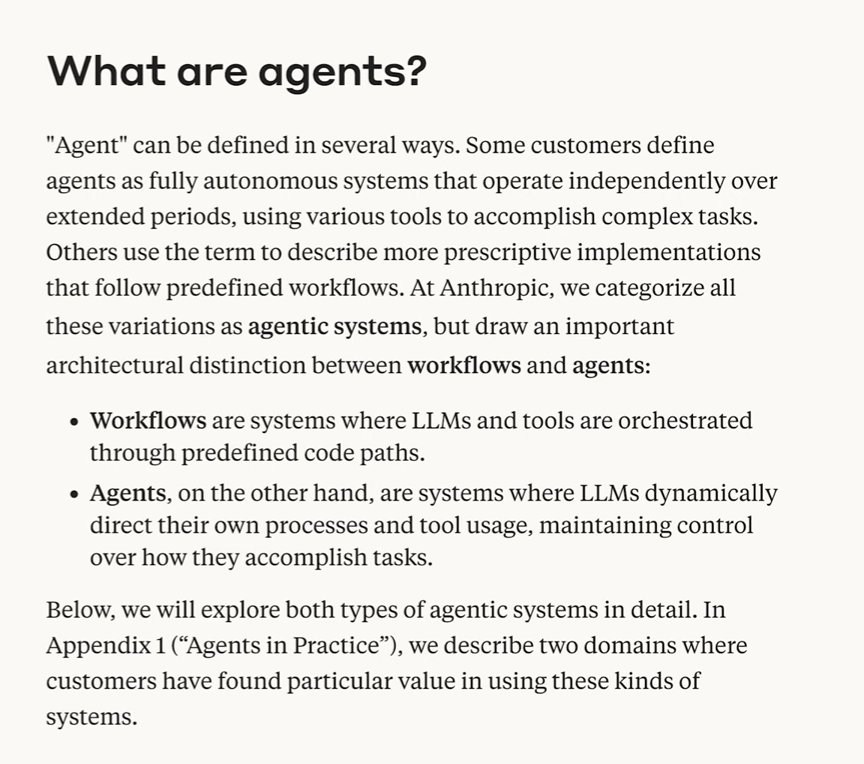
- Workflow and Agent 
    - Workflow -> AI System | LLMs and tools are orchestraed through predefined code paths
    - Agent -> AI Agent | LLMs dynamically direct this useage and maintain control

- 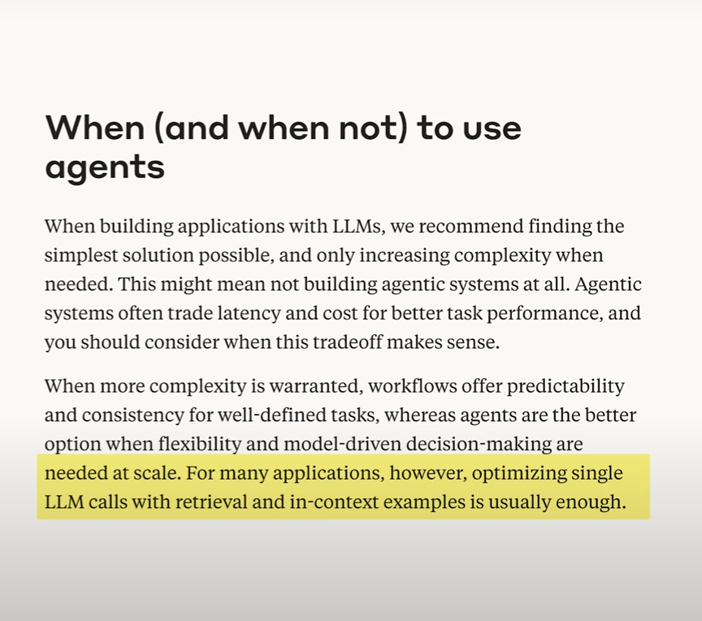
- 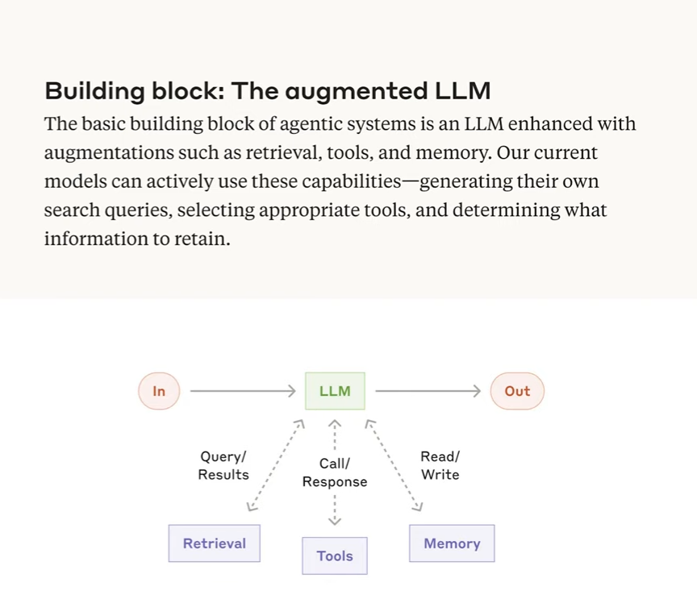
---
How to build AI systems:
1.  Retrieval - AI systems pull information from different sources e.g. database
    - 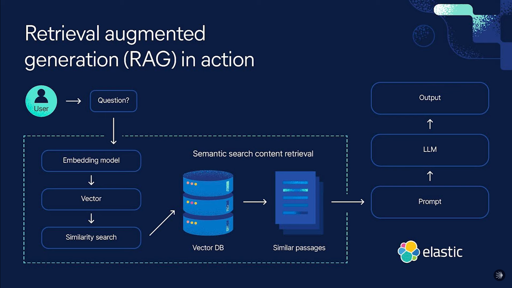
    - Done using RAG using Vector DB and performing similarity search on 
    - Giving LLM a long term memory
2. Tools - APIs that you can call inside of the application to get more information
3. Memory - past interactions you had with the LLM
---
Workflow patterns :
---
**Prompt Chaining** :
- chaining together multiple calls to an LLM 
- 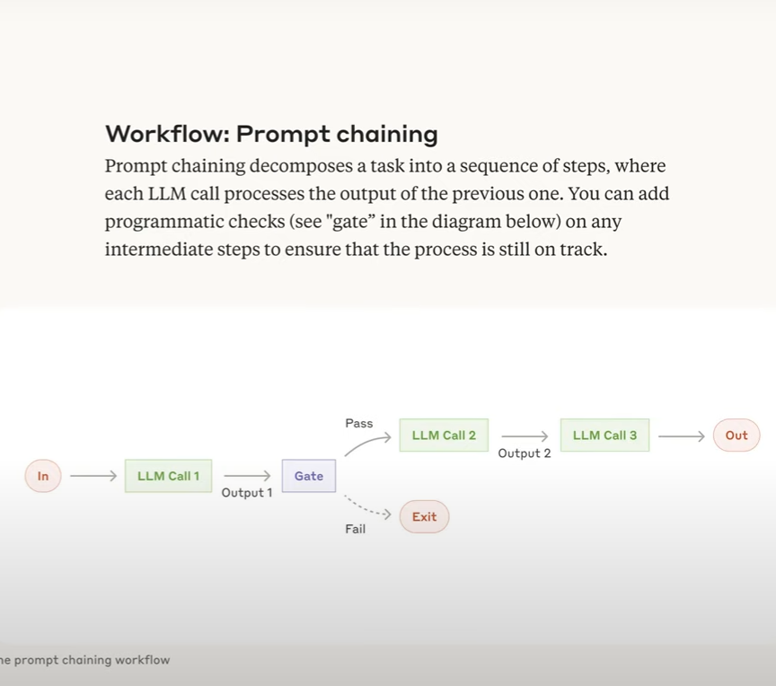

---
**Routing** 
- Prompt chaing will give us great result if focused on single problem but if the scope of problem grows bigger with multiple senarois and solutions that's where routing comes in 
- with different pathways you let the LLM take the call which route to go 
- You let LLM categorize the request. Routers are basically If statement / cases 
- 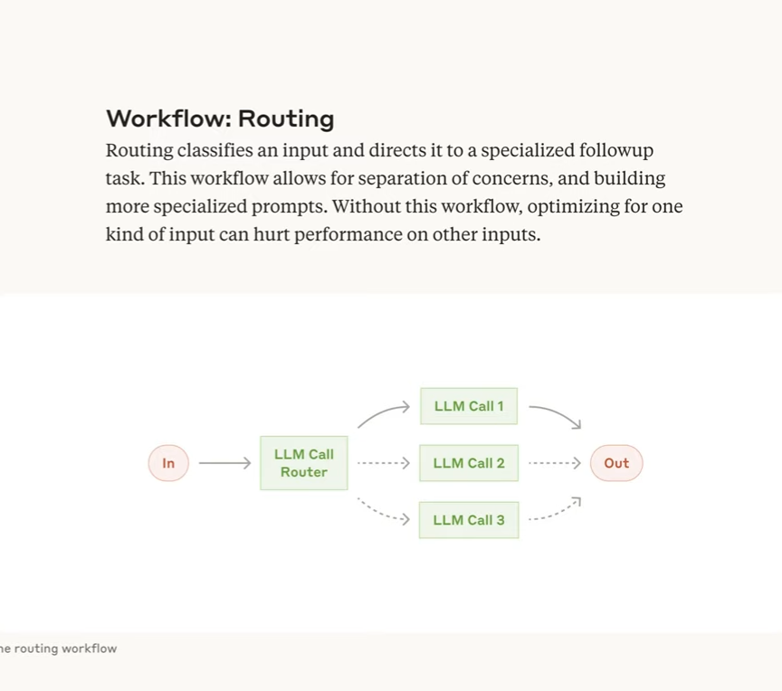
---
**Parallarization** :
- similar to prompt chaining instead of doing multiple LLM calls just rather than doing them sequentially you do it in parallel
- you split but the task but they are independent this will speed up the application and make it Async
- 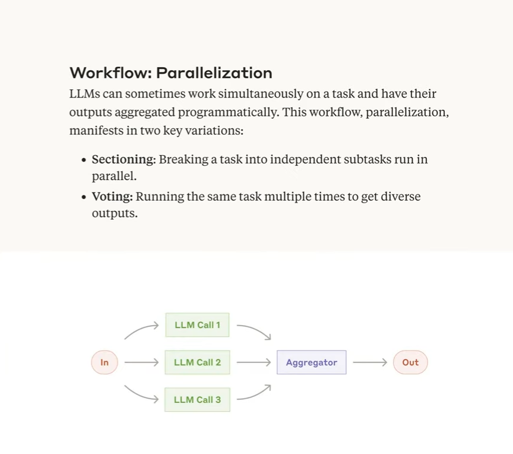

---
**Orchestrator-workers** :
- Little more agentic, needs little less programming. usecase - customer support

- 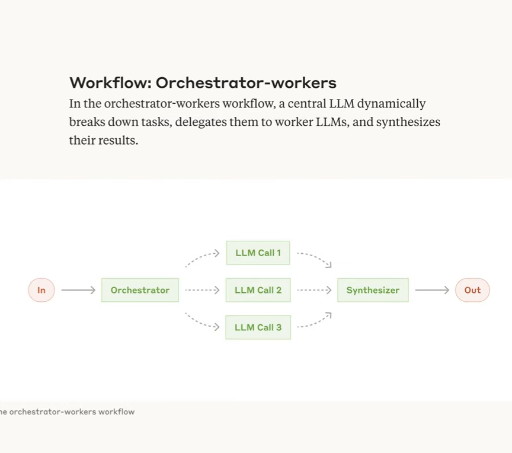
---
**Evaluator-Optimizer** :
- You let LLM create a output then feed that into another LLM call to review it get feedback and pass that to another LLM  
- 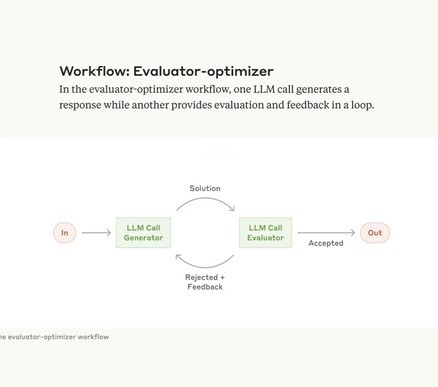
---
Agent patterns :
---
- 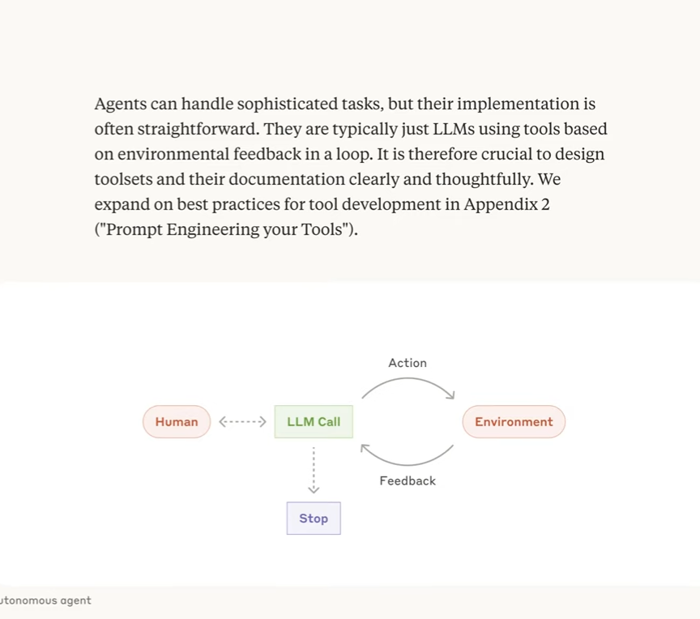
- We have human interactions here, he makes a LLM call and then LLM take a certain action.
- Now LLM is gonna check and access the output of action in the environment 
- it's gonna provide feedback back to the LLM until it reaches certain criteria like completion or feedback or success

- 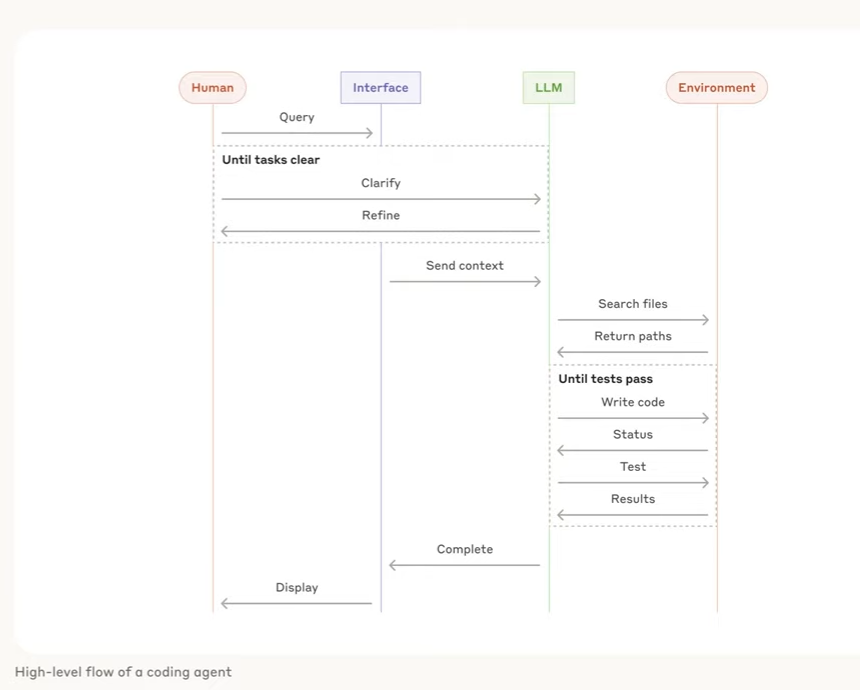

- Agents can handle sofesticated tasks
- Getting reliable results is hard

---

- Start as simple as possible and build the complexity over time 
---
Tips :
1. Be careful with agents frameworks 
2. Prioritize deterministic workflows (start small Isolate the problem)
3. Don't underestimate the scaling 
4. Your AI system needs evaluation
5. Use Guardrails for LLMs - Anothre LLM doing the quick eval before sending it to user

